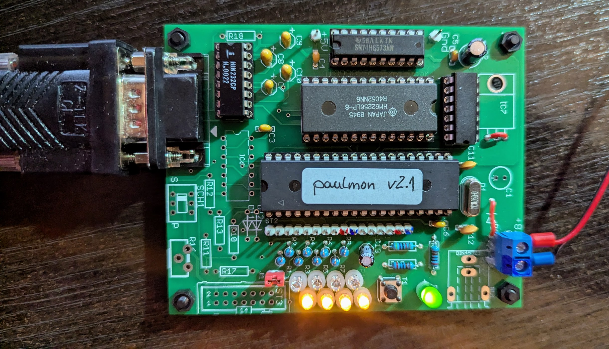
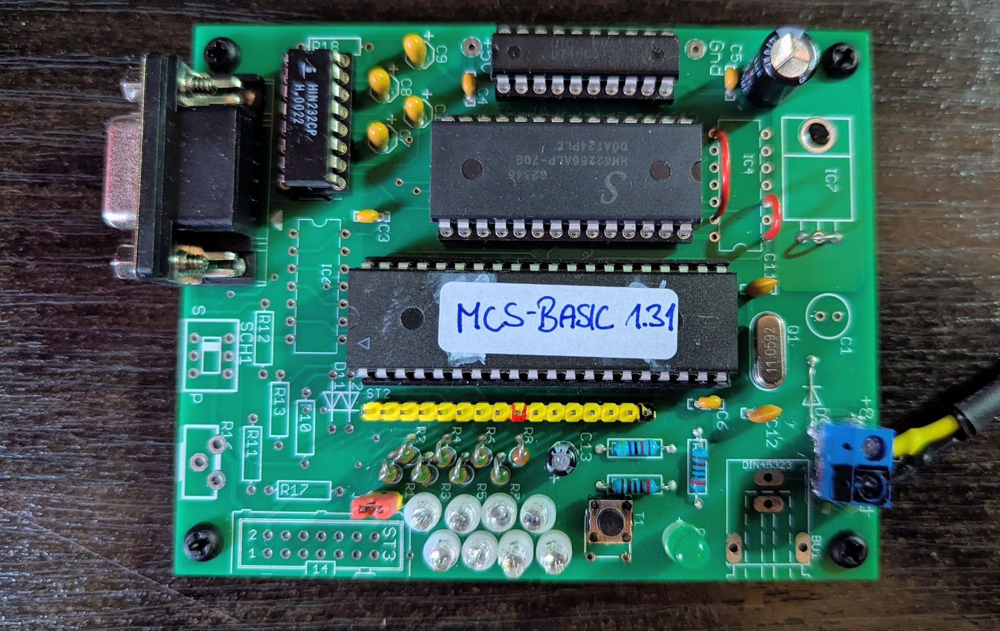
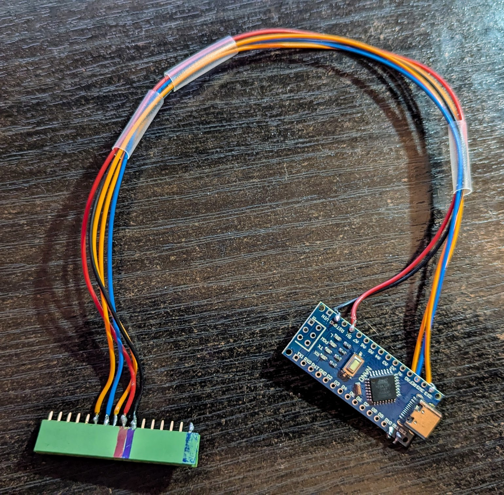

# Experimentierplatine mit AT89S51/52

Quelle: Dr. Jürgen Rathlev - https://www.rathlev-home.de/

Einfache Experimentierplatine für ein 8051-System mit externem RAM, RS232-Schnittstelle und aktivierbare LEDs an Port1

Version hier:
* Auf doppelseitiger Platine im Format 100x80 mm² (½ Europakarte)

Aufbau hier:
* Teilbestückung, ohne Programmierung via RS232 und Spannungsregler (Versorgung über USB-Anschlusskabel)
* Programmierung über ArduinoISP via Port1-Stiftleiste (dazu während der Programmierung RESET drücken)
* Orginalschaltung mit 74HC00 und RAM ab 0x8000
* vereinfachte Schaltung für MCS BASIC-52 - ohne 74HC00, dafür Control-Leitungen gebrückt

## Bestückung mit 74HC00 für RAM ab 0x800

## Bestückung ohne 74HC00 für RAM ab 0x000

## Programmieradapter mit ArduinoISP auf Nano

